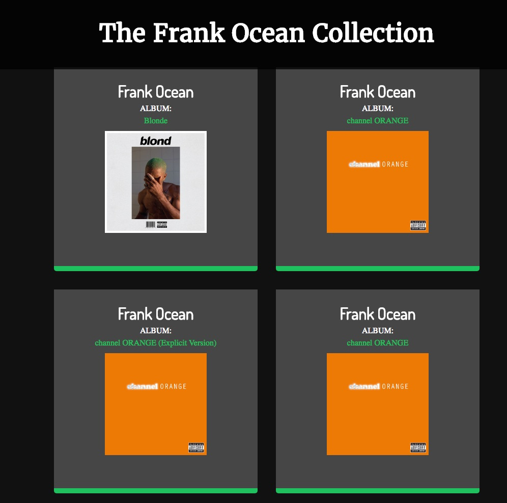

# Spotify API Pull for a specific artist

  

A styled API pull from Spotify's API for a specific artist. The webpage displays all albums by a specific Artist.

# Technologies Used

HTML5, CSS3, Github, Javascript, jQuery, API call

# Future Directions for this Project

Possibly add this into a web application if I need a spotify API call for a specific project that delivers value to users.
